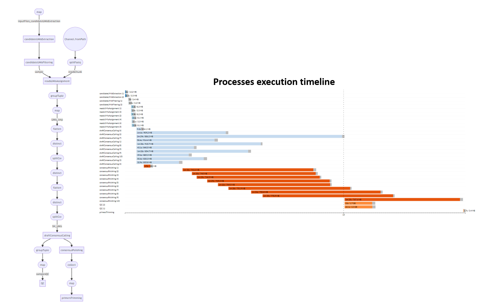

# UMInator
**UMInator** is a [Nextflow](https://www.nextflow.io) pipeline for generating consensus sequences from Nanopore reads tagged with UMIs. In particular, it builds a database of high-quality UMIs based on UMI structure, length and presence of flanking adapters and primers found in the reads, and bins them into files based on the match between candidate UMIs and high-quality UMIs. It then produces a draft consensus sequence for each UMI and polishes it using specialized software. Finally, it trims PCR primers, producing a set of high-quality consensus sequences.

<p align="center">
  
</p>

## Getting started

**Prerequisites**

* [Nextflow](https://nf-co.re/usage/installation)
* [Docker](https://docs.docker.com/engine/install/) or [Singularity](https://sylabs.io/guides/3.0/user-guide/installation.html)                                                                                  
                                                                                   
**Installation**

```
git clone https://github.com/MaestSi/UMInator.git
cd UMInator
chmod 755 *
```

## Overview

<p align="center">
  
</p>


## Usage

The CharONT2 pipeline requires you to open CharONT2.conf configuration file and set the desired options. Then, you can run the pipeline using either docker or singularity environments just specifying a value for the -profile variable.

```
Usage:
nextflow -c UMInator.conf run UMInator.nf --fastq_files = "/path/to/files*.fastq" --scripts_dir = "/path/to/scripts_dir" --results_dir = "/path/to/results_dir" -profile docker

Mandatory argument:
-profile                                                              Configuration profile to use. Available: docker, singularity
Other mandatory arguments which may be specified in the UMInator.conf file
--fastq_files                                                         Path to fastq files, use wildcards to select multiple samples
--results_dir                                                         Path to a folder where to store results
--scripts_dir                                                         Directory containing all scripts
--UMI design                                                          "double" or "single", depending on whether reads have UMIs at both ends or not
--FW_adapter                                                          Forward adapter sequence
--RV_adapter                                                          Reverse adapter sequence
--FW_primer                                                           Forward primer sequence
--RV_primer                                                           Reverse primer sequence
--searchLen                                                           Amount of bases at the beginning and end of each read to search for UMIs
--tolCutadaptErr                                                      Cutadapt maximum allowed error rate [0, 1]
--minLenOvlp                                                          Min overlap between read and adapter
--UMILen                                                              UMI length (before merging UMI1 and UMI2 in case of double UMI design)
--UMILenTol                                                           Tolerated candidate UMI discrepancy in length
--UMIPattern                                                          UMI structure (after merging UMI1 and UMI2, in case of double UMI design) in the form of a regex of the type: [nucl.]{cardinality}
--UMIClustID                                                          UMI clustering identity
--seedLen                                                             BWA seed length
--readsChunkSize                                                      Number of lines in each fastq split file (should be multiple of 4)
--min_UMI_freq                                                        Minimum number of reads assigned to UMI for generating a consensus sequence
--target_reads_consensus                                              Maximum number of reads used for consensus calling
--target_reads_polishing                                              Maximum number of reads used for consensus polishing
--plurality                                                           MAFFT plurality value: minimum fraction of aligned reads supporting a basis for including it in the preliminary consensus
--fast_alignment_flag                                                 Set fast_alignment_flag=1 if you want to perform fast multiple sequence alignment; otherwise set fast_alignment_flag=0
--medaka_model                                                        Medaka model for consensus polishing
```

## Pipeline testing
                                                                                                                                                
A test fastq dataset obtained with [DeepSimulator](https://github.com/liyu95/DeepSimulator) is provided. The datasets contains 1,000 reads simulating a heterozygous short tandem repeat expansion in DMPK gene.
For full pipeline testing, set the following parsmeters:

```                                                                                                                                                
--primerSeqOne="GCTCCGCAGGGGGGGCGGGTCTGGCCGGGAGGAGGGGCGGGGAACGGGCTAGAAAGTTTGCAGCAACTTTTCTCGAGCTTGCGTCCCAGGAGCGGATGCGC"
--primerSeqTwo="TTATCTAGGGAGATCCCGGAGGGAATCTGGTGAGGCCTGAACGGAGGGAGATCTGGGGCTGAATAAAGGGCTTCTGCCCTCTAAAGTCGCAAAGACGTAGG"
```                                                                                                                                

If the pipeline completes successfully, the following results are produced.                                                                                                                                 
                                                                                                                                
<p align="center">
  
</p>                                            

## Citation

For further information, please refer to the following manuscripts and repositories:

De Coster W, D'Hert S, Schultz DT, Cruts M, Van Broeckhoven C. NanoPack: visualizing and processing long-read sequencing data. Bioinformatics. 2018;34(15):2666-2669. doi:10.1093/bioinformatics/bty149

Li H. Minimap2: pairwise alignment for nucleotide sequences. Bioinformatics. 2018 Sep 15;34(18):3094-3100. doi: 10.1093/bioinformatics/bty191. PMID: 29750242; PMCID: PMC6137996.

R Core Team (2017). R: A language and environment for statistical computing. R Foundation for Statistical Computing, Vienna, Austria. URL https://www.R-project.org/.

Li H, Handsaker B, Wysoker A, Fennell T, Ruan J, Homer N, Marth G, Abecasis G, Durbin R; 1000 Genome Project Data Processing Subgroup. The Sequence Alignment/Map format and SAMtools. Bioinformatics. 2009 Aug 15;25(16):2078-9. doi: 10.1093/bioinformatics/btp352. Epub 2009 Jun 8. PMID: 19505943; PMCID: PMC2723002.

Rognes T, Flouri T, Nichols B, Quince C, Mahé F. VSEARCH: a versatile open source tool for metagenomics. PeerJ. 2016 Oct 18;4:e2584. doi: 10.7717/peerj.2584. PMID: 27781170; PMCID: PMC5075697.

Katoh K, Standley DM. MAFFT multiple sequence alignment software version 7: improvements in performance and usability. Mol Biol Evol. 2013 Apr;30(4):772-80. doi: 10.1093/molbev/mst010. Epub 2013 Jan 16. PMID: 23329690; PMCID: PMC3603318.

Rice P., Longden I. and Bleasby A. EMBOSS: The European Molecular Biology Open Software Suite. Trends in Genetics. 2000 16(6):276-277

Vaser R, Sović I, Nagarajan N, Šikić M. Fast and accurate de novo genome assembly from long uncorrected reads. Genome Res. 2017 May;27(5):737-746. doi: 10.1101/gr.214270.116. Epub 2017 Jan 18. PMID: 28100585; PMCID: PMC5411768.

Di Tommaso, P., Chatzou, M., Floden, E. W., Barja, P. P., Palumbo, E., & Notredame, C. (2017). Nextflow enables reproducible computational workflows. Nature Biotechnology, 35(4), 316–319. doi:10.1038/nbt.3820

[medaka](https://github.com/nanoporetech/medaka)

[seqtk](https://github.com/lh3/seqtk)
